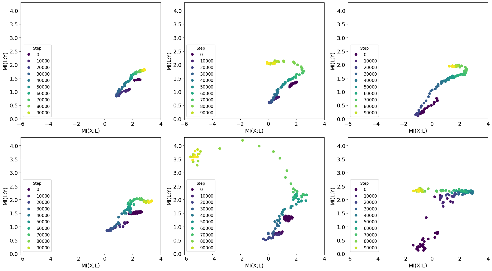

# Grokking-InfoPlane

This project explores the training dynamics during Grokking on Information Plane [1] of a 3-layer MLP. The Mutual Information (MI) estimation method is from *“Information Bottleneck Analysis of Deep Neural Networks via Lossy Compression.”* [2] (see their code https://github.com/VanessB/Information-v3) and the Grokking experiment is adopted from *“Omnigrok: Grokking Beyond Algorithmic Data.”* [3].

As per the theory proposed by Shwartz-Ziv and Tishby [2], the training can be divided into two separate phases: empirical error minimization (ERM), basically fitting, and representation compression. The results show that the dynamics of grokking in the Information Plane can be split into 3 phases: (1) the overfitting phase, where both MI values decrease. (2) the empirical error minimization phase, where both MI values increase, as well as test accuracy. (3) The representation compression phase, where MI with the input decreases.

## Running the code

To reproduce the results you need to install the `mutinfo` library from https://github.com/VanessB/Information-v3.

```python
# Run the training
py train_mnist.py

# The code uses wandb with hydra so you can specify configs
py train_mnist.py --config-path configs/custom_folder --config-name custom_config.yaml

# and certain params 
py train_mnist.py --config-path configs/custom_folder --config-name custom_config.yaml  model.initialization_scale=6

# You can actually get elaborate like that, but it gets ugly (for win10 cmd)
py train_mnist.py --config-path configs/ --config-name default.yaml ^
    project_name=custom_project_name ^
    custom_run_name=scale_${model.initialization_scale}-seed_${seed}-steps_${train.optimization_steps}-wd_${train.weight_decay}^
    model.initialization_scale=6 ^
    seed=123 ^
    train.optimization_steps=200000 ^
    train.weight_decay=0
```

`plot.ipynb` - notebook for plotting figures from this readme.

`plot_play.ipynb` - notebook with figures from my previous experiments and sweeps (over init_scale, wd, lr).

## Experiments 
The results below are acquired with the default config. Apart from the MI values, accuracy and loss some other stats are logged: weight norm, gradient and logit stats, number of "dead" neurons.


### Information Plane on evaluation subset during training

The Information Plane curves resemble the findings of the former works [1, 2]. The initial decline in both MI values stems from the overfitting and can be also seen in [1], but it happens at the end of the training. 

### Information Plane on training subset during training

The Information Plane on the training subset looks familiar with the evaluation one, but the last layer moves faster towards the compression phase.

### Information planes with same limits.

Top row - evaluation subset, bottomm row - training subset. Layers order: left-1st, middle-2nd, right-3rd.

### Accuracy with MI on evaluation subset. MI(X;L) left, MI(L;Y) right.


The increase in the test accuracy happens before the increase of mutual information even for the last layer. Perhaps the MI is not well suited for predicting delayed Generalization. However, MI values start to decrease while the test accuracy starts to grow, but this observation is too vague. The right vertical line indicates the start of the compression phase.

### Accuracy with MI on training subset. MI(X;L) left, MI(L;Y) right.


The MI with the training data of the last, 3rd, layer grows much quicker like the training accuracy.

## Discussion

The first phase of both MI's decline on evaluation subset can be explained because of the overfitting. The familiar picture could be seen in the work of Shwartz-Ziv and Tishby [1]; they show the dynamics of MI during the default training that ends with overfitting. The difference from the Grokking is that the overfitting is seen before the ERM phase.

The experiments show the drawback of the MI estimation method - negative values, which can't be possible by definition.

## References
[1] R. Shwartz-Ziv and N. Tishby, “Opening the Black Box of Deep Neural Networks via Information.” arXiv, Apr. 29, 2017. doi: 10.48550/arXiv.1703.00810.

[2] I. Butakov, A. Tolmachev, S. Malanchuk, A. Neopryatnaya, A. Frolov, and K. Andreev, “Information Bottleneck Analysis of Deep Neural Networks via Lossy Compression.” arXiv, May 13, 2023. doi: 10.48550/arXiv.2305.08013.

[3] Z. Liu, E. J. Michaud, and M. Tegmark, “Omnigrok: Grokking Beyond Algorithmic Data.” arXiv, Mar. 23, 2023. doi: 10.48550/arXiv.2210.01117.
